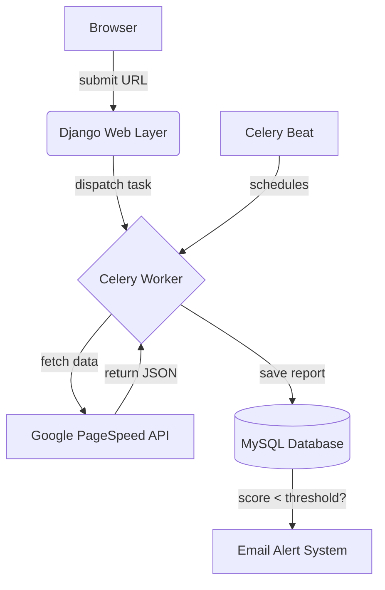

# High-Level Architecture

The PageSpeed Track & Audit Engine is built on a modern, decoupled architecture designed to prevent bottlenecks and ensure a smooth user experience.

## The Flow

## Why This Architecture?

### 1. Django Web Layer
Django handles routing, views, templates, and the ORM. It provides robust security and out-of-the-box admin capabilities.
- **Why Django over Flask/FastAPI?** We needed an integrated ORM and built-in Admin panel to easily manage Websites and historical data without building a CMS from scratch.

### 2. Celery & Redis (Asynchronous Workers)
When a user requests an audit, the Google API can take anywhere from 5 to 20 seconds to run desktop and mobile audits sequentially. 
- **Why Celery?** If Django handled this synchronously, the browser would hang and the HTTP request could time out. By offloading it to Celery, the view returns immediately ("Audit Queued"), and Celery handles the heavy lifting in the background. Redis acts as the lightning-fast message broker between Django and Celery.

### 3. django-celery-beat (Audit Automation)
We need to scan websites daily or hourly without human intervention.
- **Why Celery Beat?** A simple `while True:` loop script (`local_scheduler.py`) is fragile, blocks execution, and crashes easily. Celery Beat stores schedules inside the database, allowing us to edit cron timings dynamically from the Django Admin panel without touching code.
